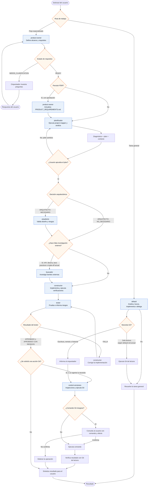

# Flujo actual de agentes

## Lectura fiel del flujo

- `orquestador` coordina siete subagentes y no ejecuta comandos directamente.
- `product-owner` siempre precede a `planificador` en el flujo especializado.
- `planificador` exige `project-mapper` antes del análisis.
- El usuario debe aprobar el plan antes de arquitectura, búsqueda o construcción.
- `arquitecto` solo participa cuando el planificador marca
  `ARQUITECTO: NECESARIO`.
- `buscador` solo participa cuando se necesita información externa.
- `constructor` implementa y verifica, pero no gestiona Git.
- `tester` siempre ocurre después de `constructor`; si falla, el orquestador
  devuelve el trabajo a `constructor`.
- `control-versiones` es el agente que puede ejecutar Git. Consulta al usuario
  antes de comandos que cambien índice, historial, ramas, archivos o remotos.
- El `default` tiene una ruta independiente. En su contenido actual todavía
  permite Git de lectura y bloquea Git de escritura; esto se muestra como una
  excepción explícita para no confundir el diagrama con una política futura.
