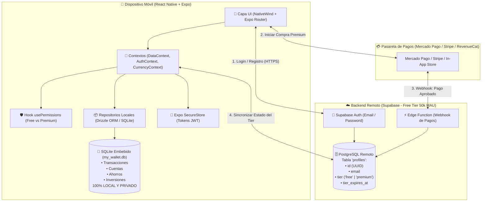
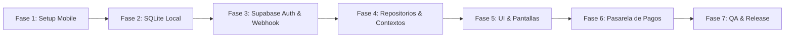

# Plan Maestro de Migración: My Wallet a React Native con SQLite Embebido, Supabase Auth y Pagos Automatizados

Este documento detalla el plan estratégico, arquitectónico y técnico definitivo para migrar la aplicación **My Wallet** desde la web (**Next.js 16 / PostgreSQL**) a un entorno celular nativo con **React Native (Expo)**. 

### Principios Fundamentales
1. **Privacidad Absoluta (Datos 100% Locales)**: Las finanzas (transacciones, balances, cuentas, metas de ahorro e inversiones) residen **exclusivamente dentro de la base SQLite local en el teléfono**. Ningún dato contable ni monto monetario viaja a la nube ni a ningún servidor externo.
2. **Autenticación Gratuita y Escalable (Supabase Auth)**: Gestión de identidades y sesiones con `@supabase/supabase-js` y `expo-secure-store`. Gratuito hasta 50.000 usuarios activos mensuales (MAU) sin mantenimiento de servidores.
3. **Activación Automática de Premium**: Integración de pasarela de pagos (Mercado Pago / Stripe / RevenueCat para In-App Purchases de Google y Apple) conectada a un Webhook en una Supabase Edge Function que actualiza automáticamente el estado de la suscripción.
4. **Reutilización Máxima del Core**: Los selectores matemáticos ([selectors.ts](file:///home/nico/Desktop/Personal%20Proyects/my-wallet/lib/selectors.ts)), formateadores ([format.ts](file:///home/nico/Desktop/Personal%20Proyects/my-wallet/lib/format.ts)) y la máquina de estados de la calculadora ([use-calculator.ts](file:///home/nico/Desktop/Personal%20Proyects/my-wallet/components/calculator/use-calculator.ts)) se mantienen intactos.

---

## 1. Visión General de la Arquitectura



---

## 2. Stack Tecnológico Seleccionado

| Componente | Tecnología | Justificación |
|---|---|---|
| **Framework Base** | **Expo SDK 52+** (React Native New Architecture) | Estabilidad, performance nativa y facilidad de build para Android e iOS. |
| **Enrutamiento** | **Expo Router v3** | Enrutador basado en archivos (`app/(tabs)/...`) análogo a Next.js App Router. |
| **Base de Datos Local** | **expo-sqlite** + **Drizzle ORM** | Persistencia ACID 100% local en el teléfono. Tipado TypeScript estricto, migraciones automáticas y cero latencia de red. |
| **Autenticación Remota** | **Supabase Auth** (`@supabase/supabase-js`) | Gratuito hasta 50.000 MAU. Autenticación con JWT, reseteo de claves y dashboard visual para gestionar usuarios. |
| **Almacenamiento Seguro** | **expo-secure-store** | Almacena el token de sesión en el Keychain de iOS y Keystore de Android. |
| **Pasarela de Pagos** | **Mercado Pago Webhook** o **RevenueCat (In-App Purchases)** | RevenueCat unifica compras en Google Play y App Store; Mercado Pago/Stripe permite cobros recurrentes en moneda local mediante Webhook hacia Supabase Edge Functions. |
| **Estilos** | **NativeWind v4** (Tailwind CSS) | Reutiliza casi todas las clases utilitarias, colores y tokens del proyecto web actual. |
| **Gráficos** | **react-native-gifted-charts** | Reemplazo móvil fluido a 60/120 FPS de Recharts para gráficos de área mensual y torta por categoría. |
| **Componentes e Iconos** | **lucide-react-native** + **@gorhom/bottom-sheet** | Iconografía idéntica a la actual y hojas modales nativas fluidas para creación de transferencias. |

---

## 3. Modelo de Datos: Separación Local vs Remoto

### 3.1. Base Remota (Supabase PostgreSQL) — Solo Identidad y Suscripciones
En Supabase **NO se guarda ningún dato financiero**. Solo la tabla de perfiles de usuario:

```sql
-- Tabla en Supabase (Remoto)
create table public.profiles (
  id uuid references auth.users on delete cascade primary key,
  email text not null,
  name text,
  tier text check (tier in ('free', 'premium')) default 'free',
  tier_expires_at timestamp with time zone,
  subscription_provider text,             -- 'mercadopago', 'stripe', 'google_play', 'app_store'
  subscription_id text,                   -- ID externo del pago/suscripción
  updated_at timestamp with time zone default now()
);

-- Trigger: al registrarse, se crea su perfil como Free
create or replace function public.handle_new_user()
returns trigger as $$
begin
  insert into public.profiles (id, email, name, tier)
  values (new.id, new.email, coalesce(new.raw_user_meta_data->>'name', 'Usuario'), 'free');
  return new;
end;
$$ language plpgsql security definer;

create trigger on_auth_user_created
  after insert on auth.users
  for each row execute procedure public.handle_new_user();
```

---

### 3.2. Base Local Embebida (SQLite Móvil) — Datos Financieros 100% Privados
Toda la información contable vive dentro del archivo `my_wallet.db` del teléfono:

```sql
-- 1. Registro de usuario local sincronizado
CREATE TABLE users (
  id INTEGER PRIMARY KEY AUTOINCREMENT,
  remote_id TEXT NOT NULL UNIQUE,          -- UUID de Supabase
  email TEXT NOT NULL UNIQUE,
  name TEXT NOT NULL,
  tier TEXT NOT NULL CHECK(tier IN ('free', 'premium')) DEFAULT 'free',
  tier_expires_at TEXT,                    -- ISO string o NULL
  last_verified_at TEXT NOT NULL,          -- Timestamp del último handshake con Supabase
  created_at TEXT NOT NULL DEFAULT (CURRENT_TIMESTAMP),
  updated_at TEXT NOT NULL DEFAULT (CURRENT_TIMESTAMP)
);

-- 2. Categorías
CREATE TABLE categories (
  id INTEGER PRIMARY KEY AUTOINCREMENT,
  name TEXT NOT NULL,
  kind TEXT NOT NULL CHECK(kind IN ('income', 'expense')),
  color TEXT NOT NULL,
  user_id INTEGER NOT NULL REFERENCES users(id) ON DELETE CASCADE,
  created_at TEXT NOT NULL DEFAULT (CURRENT_TIMESTAMP),
  updated_at TEXT NOT NULL DEFAULT (CURRENT_TIMESTAMP)
);

-- 3. Cuentas bancarias / billeteras
CREATE TABLE checking_accounts (
  id INTEGER PRIMARY KEY AUTOINCREMENT,
  name TEXT NOT NULL,
  bank_name TEXT,
  account_number TEXT,
  cbu_or_alias TEXT,
  currency TEXT NOT NULL DEFAULT 'ARS',
  initial_balance REAL NOT NULL DEFAULT 0,
  overdraft_limit REAL NOT NULL DEFAULT 0,
  color TEXT NOT NULL DEFAULT '--chart-1',
  is_default INTEGER NOT NULL DEFAULT 0,
  is_active INTEGER NOT NULL DEFAULT 1,
  user_id INTEGER NOT NULL REFERENCES users(id) ON DELETE CASCADE,
  created_at TEXT NOT NULL DEFAULT (CURRENT_TIMESTAMP),
  updated_at TEXT NOT NULL DEFAULT (CURRENT_TIMESTAMP)
);

-- 4. Transacciones
CREATE TABLE transactions (
  id INTEGER PRIMARY KEY AUTOINCREMENT,
  kind TEXT NOT NULL CHECK(kind IN ('income', 'expense')),
  amount REAL NOT NULL,
  description TEXT NOT NULL,
  category_id INTEGER NOT NULL REFERENCES categories(id) ON DELETE CASCADE,
  currency TEXT NOT NULL DEFAULT 'ARS',
  date TEXT NOT NULL,
  user_id INTEGER NOT NULL REFERENCES users(id) ON DELETE CASCADE,
  saving_goal_id INTEGER REFERENCES saving_goals(id) ON DELETE SET NULL,
  investment_contribution_id INTEGER REFERENCES investment_contributions(id) ON DELETE SET NULL,
  checking_account_id INTEGER REFERENCES checking_accounts(id) ON DELETE SET NULL,
  created_at TEXT NOT NULL DEFAULT (CURRENT_TIMESTAMP),
  updated_at TEXT NOT NULL DEFAULT (CURRENT_TIMESTAMP)
);

-- 5. Metas de Ahorro
CREATE TABLE saving_goals (
  id INTEGER PRIMARY KEY AUTOINCREMENT,
  name TEXT NOT NULL,
  target REAL NOT NULL,
  saved REAL NOT NULL DEFAULT 0,
  color TEXT NOT NULL,
  currency TEXT NOT NULL DEFAULT 'ARS',
  deadline TEXT,
  checking_account_id INTEGER REFERENCES checking_accounts(id) ON DELETE SET NULL,
  user_id INTEGER NOT NULL REFERENCES users(id) ON DELETE CASCADE,
  created_at TEXT NOT NULL DEFAULT (CURRENT_TIMESTAMP),
  updated_at TEXT NOT NULL DEFAULT (CURRENT_TIMESTAMP)
);

-- 6. Inversiones y Aportes
CREATE TABLE investments (
  id INTEGER PRIMARY KEY AUTOINCREMENT,
  name TEXT NOT NULL,
  description TEXT NOT NULL,
  invested REAL NOT NULL DEFAULT 0,
  current_value REAL NOT NULL DEFAULT 0,
  currency TEXT NOT NULL DEFAULT 'ARS',
  checking_account_id INTEGER REFERENCES checking_accounts(id) ON DELETE SET NULL,
  user_id INTEGER NOT NULL REFERENCES users(id) ON DELETE CASCADE,
  created_at TEXT NOT NULL DEFAULT (CURRENT_TIMESTAMP),
  updated_at TEXT NOT NULL DEFAULT (CURRENT_TIMESTAMP)
);

CREATE TABLE investment_contributions (
  id INTEGER PRIMARY KEY AUTOINCREMENT,
  investment_id INTEGER NOT NULL REFERENCES investments(id) ON DELETE CASCADE,
  date TEXT NOT NULL,
  amount REAL NOT NULL,
  note TEXT,
  currency TEXT NOT NULL DEFAULT 'ARS',
  checking_account_id INTEGER REFERENCES checking_accounts(id) ON DELETE SET NULL,
  user_id INTEGER NOT NULL REFERENCES users(id) ON DELETE CASCADE,
  created_at TEXT NOT NULL DEFAULT (CURRENT_TIMESTAMP)
);

-- 7. Transferencias entre cuentas
CREATE TABLE account_transfers (
  id INTEGER PRIMARY KEY AUTOINCREMENT,
  source_account_id INTEGER NOT NULL REFERENCES checking_accounts(id) ON DELETE CASCADE,
  target_account_id INTEGER NOT NULL REFERENCES checking_accounts(id) ON DELETE CASCADE,
  source_amount REAL NOT NULL,
  target_amount REAL NOT NULL,
  exchange_rate REAL,
  date TEXT NOT NULL,
  description TEXT,
  user_id INTEGER NOT NULL REFERENCES users(id) ON DELETE CASCADE,
  created_at TEXT NOT NULL DEFAULT (CURRENT_TIMESTAMP)
);

-- Índices de Rendimiento
CREATE INDEX idx_tx_user_date ON transactions(user_id, date DESC);
CREATE INDEX idx_tx_category ON transactions(category_id);
CREATE INDEX idx_accounts_user ON checking_accounts(user_id);
```

---

## 4. Activación Automática de Premium y Pagos

### 4.1. Flujo del Webhook de Pago Automatizado
1. El usuario presiona **"Actualizar a Premium"** dentro de la app móvil.
2. La app inicia el checkout (vía SDK de Mercado Pago / Stripe, o vía `react-native-purchases` con RevenueCat).
3. Una vez completado el pago:
   - La pasarela dispara un Webhook HTTPS a una **Supabase Edge Function** (`/payment-webhook`).
   - La Edge Function verifica la firma criptográfica del pago.
   - Si el estado es `approved` o `paid`, la función ejecuta un UPDATE en la tabla remota `profiles`:
     ```typescript
     // Ejemplo en Supabase Edge Function
     await supabase
       .from('profiles')
       .update({
         tier: 'premium',
         tier_expires_at: calculateExpiration(event.duration),
         subscription_provider: 'mercadopago',
         subscription_id: event.payment_id
       })
       .eq('id', event.user_id)
     ```
4. **Sincronización en la App**:
   - La app móvil escucha la respuesta del checkout o llama a `supabase.from('profiles').select('tier, tier_expires_at').single()`.
   - Se actualiza el registro de la tabla SQLite local `users`.
   - Se activan inmediatamente todas las características Premium sin necesidad de reiniciar la app.

### 4.2. Reglas de Negocio Free vs Premium (Feature Gating)

| Funcionalidad | Plan Free | Plan Premium |
|---|---|---|
| **Cuentas Bancarias / Billeteras** | Máximo 2 cuentas | Cuentas ilimitadas |
| **Metas de Ahorro** | Máximo 2 metas activas | Metas ilimitadas |
| **Inversiones** | Máximo 3 activos registrados | Ilimitadas + gráficos de rendimiento |
| **Monedas** | Solo ARS | Multi-moneda automática (ARS y USD) |
| **Exportación / Backup** | No disponible | Exportación a Excel / CSV y archivo de Backup SQLite |
| **Calculadora Flotante** | Versión básica | Historial ilimitado y conversión instantánea |

Implementación en código mediante hook centralizado:
```typescript
export function usePermissions() {
  const { user } = useAuth()
  const isPremium = user?.tier === "premium" && (!user.tierExpiresAt || new Date(user.tierExpiresAt) > new Date())

  return {
    isPremium,
    maxAccounts: isPremium ? Infinity : 2,
    maxSavingGoals: isPremium ? Infinity : 2,
    canUseMultiCurrency: isPremium,
    canExportExcel: isPremium,
  }
}
```

---

## 5. Fases de la Migración



### Fase 1: Inicialización del Proyecto Mobile
* Crear proyecto Expo SDK 52 con TypeScript y Expo Router:
  ```bash
  npx create-expo-app my-wallet-mobile --template tabs
  ```
* Configurar **NativeWind v4** con los mismos tokens de color y tema (modo oscuro/claro, paletas esmeralda y celeste).
* Instalar dependencias: `@supabase/supabase-js`, `expo-sqlite`, `drizzle-orm`, `drizzle-kit`, `expo-secure-store`, `lucide-react-native`, `react-native-reanimated`, `@gorhom/bottom-sheet`, `react-native-gifted-charts`.

### Fase 2: Capa de Base de Datos Local (SQLite + Drizzle)
* Crear el cliente singleton SQLite en `src/db/client.ts`.
* Definir el esquema Drizzle con todas las tablas financieras locales documentadas en la sección 3.2.
* Implementar seeder inicial de categorías predeterminadas (comida, transporte, servicios, etc.) al crear un nuevo usuario local.
* Crear utilitarios para exportar / importar copia de seguridad local del archivo `.db`.

### Fase 3: Configuración de Supabase Auth & Edge Function
* Crear proyecto gratuito en Supabase.
* Ejecutar el script SQL de la tabla `profiles` y el trigger `handle_new_user`.
* Configurar cliente Supabase en la app móvil con adaptador para `expo-secure-store`.
* Desarrollar la **Supabase Edge Function** para recibir los webhooks de pago y actualizar el tier a `premium`.

### Fase 4: Repositorios Locales y Adaptación de Contextos
* Implementar los repositorios CRUD que reemplazan a las Server Actions actuales:
  * `src/repositories/transaction.repository.ts`
  * `src/repositories/account.repository.ts`
  * `src/repositories/category.repository.ts`
  * `src/repositories/saving.repository.ts`
  * `src/repositories/investment.repository.ts`
* Adaptar los Contextos React:
  * `AuthContext`: Administra login/logout con Supabase y sincroniza el perfil remoto con la tabla `users` de SQLite local.
  * `DataContext`: Expone exactamente las mismas firmas (`transactions`, `categories`, `addTransaction`, etc.), ejecutando las operaciones directamente sobre SQLite local.
  * `CurrencyContext`: Mantiene el switch USD/ARS y funciones de formateo.

### Fase 5: Migración de Vistas y Componentes Móviles
* Estructura de navegación con Expo Router:
  * `app/(auth)/login.tsx` y `register.tsx`.
  * `app/(tabs)/index.tsx` (Dashboard principal con métricas, balance y gráficos de área).
  * `app/(tabs)/transfers/` (Lista con tabs Ingresos/Gastos + modal BottomSheet para crear/editar transacciones).
  * `app/(tabs)/savings.tsx` (Metas de ahorro con barras de progreso).
  * `app/(tabs)/investments/` (Lista de inversiones y detalle de rendimientos).
* Migrar componentes reutilizables:
  * [selectors.ts](file:///home/nico/Desktop/Personal%20Proyects/my-wallet/lib/selectors.ts) y [format.ts](file:///home/nico/Desktop/Personal%20Proyects/my-wallet/lib/format.ts) (100% directos).
  * Calculadora flotante: botón flotante (FAB) nativo reutilizando [use-calculator.ts](file:///home/nico/Desktop/Personal%20Proyects/my-wallet/components/calculator/use-calculator.ts).
  * Gráficos interactivos con `react-native-gifted-charts`.

### Fase 6: Integración de Pagos y Feature Gating
* Integrar SDK de pagos (Mercado Pago Checkout / Stripe / RevenueCat).
* Crear pantalla modal `app/modals/upgrade.tsx` con la comparativa Free vs Premium.
* Enlazar el webhook de aprobación de pago con la Edge Function de Supabase para activar el plan de forma instantánea.
* Aplicar el hook `usePermissions()` para limitar cuentas, metas de ahorro y multi-moneda en usuarios Free.

### Fase 7: Pruebas, Seguridad y Publicación
* Validar persistencia y performance offline en modo avión completo.
* Verificar que ningún dato financiero salga del dispositivo hacia la red.
* Auditoría de seguridad de tokens en Keychain / Keystore.
* Compilación de binarios de producción con **EAS Build** (APK para Android y TestFlight para iOS).

---

## 6. Matriz de Reutilización de Código

```
┌─────────────────────────────────────────────────────────────┐
│ 100% REUTILIZABLE DIRECTAMENTE                              │
│ • lib/selectors.ts (totales, series mensuales, categorías)  │
│ • lib/format.ts (formato de monedas y fechas)               │
│ • components/calculator/use-calculator.ts (state machine)  │
│ • lib/types.ts (adaptando User a remote_id y tier)          │
└──────────────────────────────┬──────────────────────────────┘
                               │
┌──────────────────────────────▼──────────────────────────────┐
│ ADAPTACIÓN DIRECTA (MISMA LÓGICA, NUEVO DRIVER)             │
│ • context/data-context.tsx → Llama a SQLite en vez de SA    │
│ • context/auth-context.tsx → Usa Supabase + SecureStore     │
│ • lib/theme.ts → Tokens de color para NativeWind            │
└──────────────────────────────┬──────────────────────────────┘
                               │
┌──────────────────────────────▼──────────────────────────────┐
│ REESCRITURA PARA ENTORNO MÓVIL                              │
│ • Componentes visuales UI (BottomSheet, FlatList en vez de web) │
│ • Gráficos (react-native-gifted-charts en vez de Recharts)  │
│ • Navegación (Expo Router v3 en vez de Next App Router)     │
│ • Capa de persistencia (SQLite local en vez de PostgreSQL)   │
└─────────────────────────────────────────────────────────────┘
```

---

## 7. Próximos Pasos para Iniciar

1. **Crear el proyecto Expo** en una carpeta paralela (ej. `my-wallet-mobile`).
2. **Crear el proyecto gratuito en Supabase** y ejecutar el script SQL de `profiles`.
3. **Elegir la pasarela de pagos primaria** para la Fase 6 (ej. Mercado Pago para cobros en ARS, Stripe para USD internacional, o RevenueCat si se priorizan compras integradas de Google/Apple).
